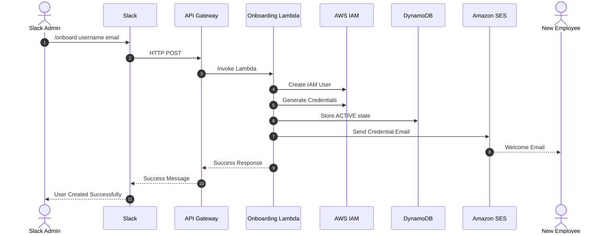
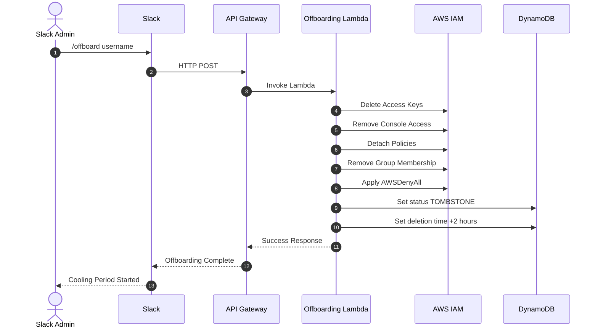
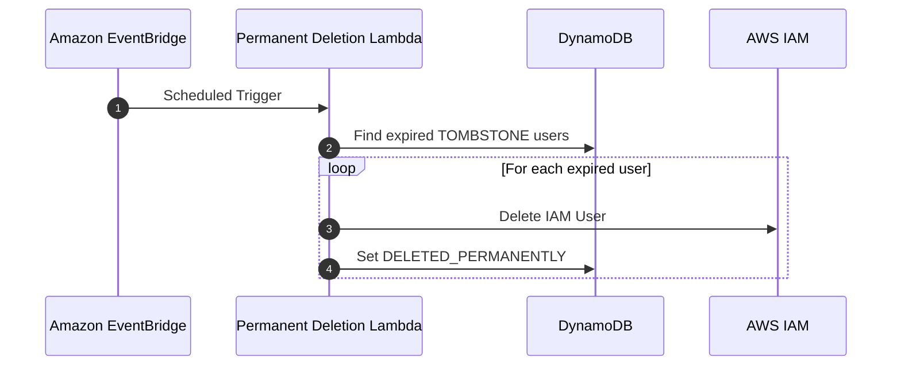

# Zero-Touch AWS IAM User Lifecycle Management System

A serverless, ChatOps-powered AWS Identity and Access Management (IAM) automation system that manages the employee access lifecycle from **onboarding to offboarding and access restoration**.

The project uses **Slack commands to trigger AWS workflows**, automates IAM user management through AWS Lambda, maintains lifecycle records in DynamoDB, sends credentials securely through Amazon SES, and provides a visual audit dashboard hosted on Amazon S3.

---

## Project Overview

Managing IAM users manually can become time-consuming and error-prone, especially as the number of employees and cloud resources grows.

This project was designed to address common challenges in user access management:

* **Slow onboarding:** New employees may have to wait for IT teams to manually create accounts and provide access.
* **Offboarding risks:** Active credentials and access keys can remain enabled if access is not revoked promptly.
* **Human error:** Manual IAM configuration can result in missing permissions or unnecessarily broad access.
* **Limited visibility:** Without centralized audit records, it can be difficult to track when users were created, offboarded, restored, or permanently deleted.

### The Solution

The **Zero-Touch User Lifecycle Management System** automates these activities through a Slack-based ChatOps workflow.

An administrator can use simple Slack commands such as:

```text
/onboard
/offboard
/restore
```

These commands trigger API Gateway endpoints, which invoke AWS Lambda functions responsible for performing the required IAM operations.

The system also maintains lifecycle state in DynamoDB and provides a dashboard for monitoring user status.

The goal is to reduce repetitive administrative work while improving **security, consistency, traceability, and operational efficiency**.

---

# Architecture

```text
                          ┌──────────────────────────────┐
                          │        SLACK WORKSPACE       │
                          │                              │
                          │ /onboard  /offboard /restore │
                          │ /audit                      │
                          └──────────────┬───────────────┘
                                         │
                                    HTTPS POST
                                         │
                                         ▼
                          ┌──────────────────────────────┐
                          │      AMAZON API GATEWAY      │
                          │                              │
                          │ /onboard                     │
                          │ /offboard                    │
                          │ /restore                     │
                          │ /audit                       │
                          └──────────────┬───────────────┘
                                         │
                                         ▼
                          ┌──────────────────────────────┐
                          │         AWS LAMBDA           │
                          │                              │
                          │  ┌────────────────────────┐  │
                          │  │ Onboarding Lambda      │  │
                          │  ├────────────────────────┤  │
                          │  │ Offboarding Lambda     │  │
                          │  ├────────────────────────┤  │
                          │  │ Restore Lambda         │  │
                          │  ├────────────────────────┤  │
                          │  │ Permanent Deletion     │  │
                          │  └────────────────────────┘  │
                          └───────┬──────────┬───────────┘
                                  │          │
                    ┌─────────────┘          └──────────────┐
                    ▼                                       ▼
          ┌───────────────────┐                   ┌───────────────────┐
          │     AWS IAM       │                   │    DynamoDB       │
          │                   │                   │                   │
          │ Users             │                   │ Lifecycle State   │
          │ Access Keys       │                   │ Audit Records     │
          │ Policies          │                   │ User Status       │
          └───────────────────┘                   └───────────────────┘
                    │
                    │
                    ▼
          ┌───────────────────┐
          │   Amazon SES      │
          │                   │
          │ Credential Email  │
          └───────────────────┘


          ┌───────────────────┐
          │ Amazon EventBridge │
          │                   │
          │ Scheduled Cleanup │
          └─────────┬─────────┘
                    │
                    ▼
          ┌───────────────────┐
          │ Permanent Delete  │
          │ Lambda            │
          └───────────────────┘


          ┌───────────────────┐
          │    Amazon S3      │
          │                   │
          │ Audit Dashboard   │
          │ Static HTML/JS    │
          └───────────────────┘
```

---

# Key Features

### 1. ChatOps-Based Onboarding

Administrators can initiate onboarding directly from Slack using:

```text
/onboard <username> <email>
```

The workflow:

1. Receives the Slack command.
2. Sends the request through API Gateway.
3. Invokes the onboarding Lambda function.
4. Creates the IAM user.
5. Generates access credentials.
6. Configures the required IAM permissions.
7. Records the lifecycle event in DynamoDB.
8. Sends the credentials through Amazon SES.
9. Returns the operation result to Slack.

This removes much of the repetitive manual work involved in creating new IAM users.

---

### 2. Secure Soft-Offboarding

The `/offboard` command begins the access-revocation process:

```text
/offboard <username>
```

The system:

* Removes active access keys.
* Removes console access.
* Detaches applicable policies.
* Removes group memberships.
* Applies an `AWSDenyAll` policy.
* Updates the user's lifecycle state in DynamoDB.
* Starts the temporary cooling period.

The purpose of this approach is to immediately prevent further AWS activity while keeping the user record available for auditing and potential restoration.

---

### 3. Compliance Cooling Window

Instead of immediately deleting an offboarded IAM user, the system places the user into a temporary **TOMBSTONE** state.

```text
ACTIVE
   │
   │ /offboard
   ▼
TOMBSTONE
   │
   ├──────────────► /restore
   │
   │ 2-hour window expires
   ▼
DELETED_PERMANENTLY
```

During this period, the user's access remains blocked.

This provides an additional operational safety window in case an offboarding request was submitted incorrectly or the employee needs their access restored.

---

### 4. One-Click Access Restoration

During the cooling window, an administrator can restore access using:

```text
/restore <username>
```

The restoration workflow:

1. Identifies the quarantined user.
2. Removes the deny policy.
3. Restores the required access configuration.
4. Generates new access keys.
5. Resets console access where required.
6. Sends updated credentials through Amazon SES.
7. Updates the DynamoDB lifecycle record.

This provides a controlled recovery mechanism without manually rebuilding the IAM user.

---

### 5. Automated Permanent Deletion

Amazon EventBridge triggers a scheduled Lambda function to identify users whose cooling period has expired.

The cleanup workflow:

```text
EventBridge
     │
     ▼
Permanent Deletion Lambda
     │
     ▼
Check DynamoDB for expired TOMBSTONE records
     │
     ▼
Delete IAM resources
     │
     ▼
Update status to DELETED_PERMANENTLY
```

This reduces the risk of abandoned IAM resources remaining indefinitely.

---

### 6. Audit Dashboard

An HTML/JavaScript dashboard is hosted on Amazon S3 and provides visibility into the user lifecycle.

The dashboard can be used to monitor states such as:

```text
ACTIVE
TOMBSTONE
DELETED_PERMANENTLY
```

This gives administrators a simple way to understand the current state of IAM users without manually checking multiple AWS services.

---

# Technology Stack

| Category             | Technology                       |
| -------------------- | -------------------------------- |
| Compute              | AWS Lambda                       |
| Programming Language | Python 3.12                      |
| API Management       | Amazon API Gateway               |
| Identity Management  | AWS IAM                          |
| Database             | Amazon DynamoDB                  |
| Scheduling           | Amazon EventBridge               |
| Email                | Amazon SES                       |
| ChatOps              | Slack API                        |
| Dashboard            | Amazon S3, HTML, CSS, JavaScript |
| Monitoring           | Amazon CloudWatch                |
| Version Control      | Git & GitHub                     |

---

# Project Structure

```text
Zero-Touch-User-Lifecycle-Management/
│
├── dashboard/
│   └── index.html
│
├── docs/
│   ├── API_Gateway.png
│   ├── architecture.png
│   ├── architecture.md
│   ├── business-case.md
│   └── troubleshooting.md
│
├── dynamodb/
│   └── table-schema.json
│
├── iam/
│   └── lambda-role-policy.json
│
├── lambdas/
│   │
│   ├── onboarding/
│   │   ├── lambda_function.py
│   │   └── requirements.txt
│   │
│   ├── offboarding/
│   │   ├── lambda_function.py
│   │   └── requirements.txt
│   │
│   ├── restore/
│   │   ├── lambda_function.py
│   │   └── requirements.txt
│   │
│   └── permanent-deletion/
│       ├── lambda_function.py
│       └── requirements.txt
│
├── sample-events/
│   └── Mock payloads for testing
│
├── screenshots/
│   └── Execution and output screenshots
│
├── slack/
│   ├── slash-commands-config.md
│   └── slack-payload-example.json
│
├── .gitignore
├── LICENSE
├── README.md
└── requirements.txt
```

---

# Security Considerations

Security was considered throughout the design rather than being treated as an afterthought.

### Least-Privilege IAM

Lambda execution roles are designed around the AWS API operations required by each workflow.

Examples include:

```text
iam:CreateUser
iam:DeleteUser
iam:CreateAccessKey
iam:DeleteAccessKey
dynamodb:PutItem
dynamodb:UpdateItem
ses:SendEmail
```

The objective is to avoid granting unnecessary permissions to automation functions.

### Credential Protection

Credentials are not returned through public Slack messages.

Sensitive credentials are delivered through Amazon SES to the configured email address.

### Immediate Access Quarantine

Offboarding removes active credentials and applies an explicit deny policy to prevent continued AWS activity during the cooling period.

### Auditability

Lifecycle state changes are recorded in DynamoDB with timestamps and relevant action information.

Example lifecycle states:

```text
ACTIVE
TOMBSTONE
DELETED_PERMANENTLY
```

### Collision-Resistant Usernames

The system can use generated suffixes when creating usernames to reduce the possibility of naming conflicts.

Example:

```text
john-doe-7f42
```

---

# Onboarding Workflow



---

# Offboarding Workflow



---

# Permanent Deletion Workflow



---

# Example ChatOps Commands

### Onboard a User

```text
/onboard john.doe john.doe@example.com
```

### Offboard a User

```text
/offboard john.doe
```

### Restore a User

```text
/restore john.doe
```

The exact command format depends on the Slack slash-command configuration used for the deployment.

---

# Business Value

This project demonstrates how cloud automation can solve a real operational problem rather than simply connecting AWS services together.

### Operational Benefits

* Reduces repetitive IAM administration.
* Speeds up employee onboarding.
* Minimizes delays during employee offboarding.
* Reduces the possibility of forgotten active credentials.
* Provides a controlled recovery mechanism.
* Creates a centralized lifecycle audit trail.
* Improves visibility through a simple dashboard.
* Demonstrates event-driven serverless architecture.

### Skills Demonstrated

This project brings together several areas that are highly relevant to Cloud and DevOps roles:

```text
AWS Lambda
AWS IAM
Amazon API Gateway
Amazon DynamoDB
Amazon EventBridge
Amazon SES
Amazon S3
Amazon CloudWatch
Slack API
Python
REST APIs
Serverless Architecture
IAM Security
ChatOps
Automation
Audit Logging
Git & GitHub
```

---

# Observability

Amazon CloudWatch Logs can be used to monitor Lambda executions and troubleshoot workflow failures.

Important events to monitor include:

* Lambda invocation failures
* IAM API errors
* DynamoDB operation failures
* SES delivery errors
* Invalid Slack requests
* Unexpected workflow states
* Permanent deletion failures

Centralized logs make it easier to investigate issues without manually checking each AWS service.

---

# Future Enhancements

The current architecture provides a foundation that can be extended further.

### Infrastructure as Code

Deploy the complete infrastructure using:

```text
Terraform
```

or

```text
AWS CDK
```

This would make the environment easier to reproduce and deploy across multiple accounts.

### Role-Based Access Control

Extend onboarding commands to support predefined job roles.

Example:

```text
/onboard john.doe developer
```

The system could then assign the appropriate IAM group or role based on the employee's job function.

### Approval Workflow

Introduce Slack interactive buttons for sensitive operations.

For example:

```text
Offboarding Request

User: john.doe

[ Approve ]    [ Reject ]
```

This would add an additional authorization layer for production environments.

### IAM Identity Center

The project can be extended to use **AWS IAM Identity Center** and federated identity providers for larger organizations instead of relying primarily on IAM users.

---

# What I Learned

Building this project helped me understand how individual AWS services can be combined into a complete cloud automation workflow.

Key areas covered include:

* Designing serverless architectures using AWS Lambda.
* Working with IAM users, policies, access keys, and permissions.
* Building REST-based integrations using API Gateway.
* Using DynamoDB for application state and audit records.
* Automating scheduled tasks with EventBridge.
* Sending transactional emails using Amazon SES.
* Integrating AWS services with Slack using ChatOps.
* Applying least-privilege principles to Lambda execution roles.
* Implementing lifecycle states for safer resource management.
* Monitoring serverless applications through CloudWatch.
* Structuring and documenting a real-world cloud project using Git and GitHub.

---

# How This Project Demonstrates Cloud & DevOps Skills

This project is more than an IAM automation script. It demonstrates the ability to design and implement a complete cloud workflow involving:

```text
User Request
     ↓
Slack ChatOps
     ↓
API Gateway
     ↓
AWS Lambda
     ↓
IAM / DynamoDB / SES
     ↓
EventBridge Automation
     ↓
Audit Dashboard
     ↓
CloudWatch Monitoring
```

It demonstrates practical experience with **automation, serverless computing, cloud security, API integration, event-driven architecture, monitoring, and lifecycle management**.

---

# Author

**Sujitha**

Cloud & DevOps Engineer

---

# License

This project is licensed under the MIT License.

See the `LICENSE` file for details.
